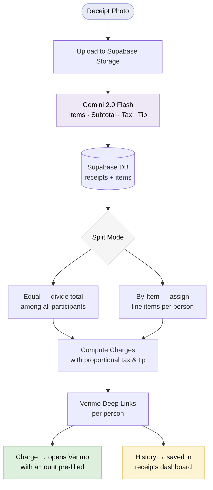

# Open Tab

Open Tab is a mobile-first bill-splitting app that turns a photo of a receipt into pre-filled Venmo payment requests — split equally or by item, charged to friends in one tap.

---

## The Problem

Splitting a dinner bill is a solved social problem and an unsolved technical one. Everyone has a calculator and a Venmo app, but the actual work — reading the receipt, doing the math, opening Venmo, typing the amount and username, sending the request — gets done by the person who paid, after the night ends, usually while their friends have already left. Open Tab collapses that into a 30-second phone interaction at the table.

---

## The Solution

Photograph the receipt. A vision model reads it and pulls out every line item, the subtotal, tax, and tip. Choose equal split or assign specific items to each person. The app computes each friend's share and generates a deep link straight into Venmo with the amount and note pre-filled — one tap per person to send the request.

**Stack:** Next.js 16 + React 19 + TypeScript + Tailwind CSS v4 + Supabase (PostgreSQL + Auth + Storage) + Gemini 2.0 Flash + Venmo deep links

*↑ Add a screenshot of the split step here*

---

## Architecture

The multi-step flow (capture → scanning → split → charge) is managed by a single `useReceiptFlow` hook, persisted to `sessionStorage` so refreshes don't lose progress. Receipts and their items are stored in Supabase; charges are computed client-side from the split configuration.

---

## Tradeoffs and Decisions

| Decision | What I considered | What I chose and why |
|---|---|---|
| Receipt parsing | Dedicated OCR (Tesseract, AWS Textract) or a vision model | Gemini 2.0 Flash with a structured JSON prompt — handles printed and handwritten receipts without custom training, returns typed data directly |
| Venmo integration | Full OAuth API (request money, track status) | Deep links only — Venmo's OAuth requires API approval and adds auth complexity. Deep links are a documented public interface, work instantly on mobile, and required nothing beyond a URL format |
| Flow state persistence | Server-persisted draft receipts written on every edit | `sessionStorage` in the `useReceiptFlow` hook — zero latency during editing, no DB writes until the user finalizes, survives page reloads within the same tab |
| Tax & tip distribution | Split tax and tip equally among all participants | Distribute proportionally by item share — fairer when people ordered different-priced items; small overhead since the item amounts are already computed |

---

## What I Learned

- **AI for unstructured, code for structured:** Receipt images are inherently unstructured — different layouts, fonts, handwriting — so a vision model is the right tool. But once items are parsed, distributing tax and tip proportionally is pure arithmetic. Reaching for the model at that stage would be the wrong call.

- **Platform constraints are disguised design decisions:** Venmo's OAuth API requires an approval process that's out of reach for a side project. Deep links turned out to be strictly better for this use case anyway — no redirect flow, no token management, and the payment opens directly in the native app. The constraint forced a simpler and faster UX.

- **Put complex multi-step flow state in one place:** The four-step receipt flow touches capture, AI parsing, split configuration, and charge generation. Managing that as a single hook with a clear state shape eliminated cross-page coordination problems and made the session-persistence story trivial — one hook, one `sessionStorage` key.
