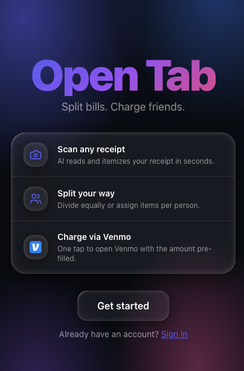
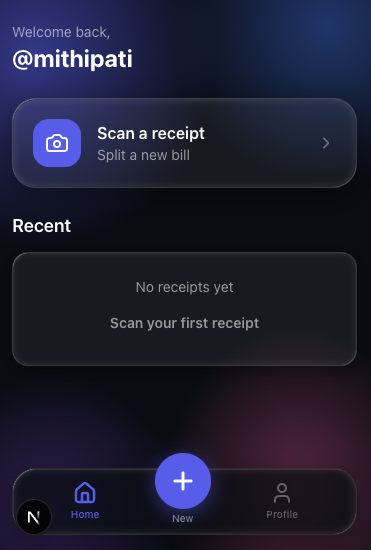
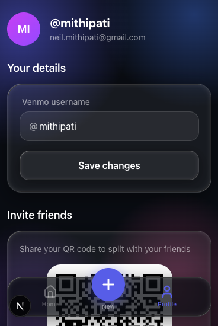

# Open Tab

Open Tab is a mobile-first bill-splitting app that turns a photo of a receipt into Venmo payment requests. Split equally or by item, charge friends in one tap.

---

## Problem

Splitting a dinner bill is a solved social problem and an unsolved technical one. Everyone has a calculator and a Venmo app, but the actual work of reading the receipt, doing the math, opening Venmo, typing the amount and username, and sending the request takes too long by the person who paid.

---

## Solution

Photograph the receipt. A vision model reads it and pulls out every line item, the subtotal, tax, and tip. Choose equal split or assign specific items to each person. The app computes each friend's share and generates a deep link straight into Venmo with the amount and note pre-filled — one tap per person to send the request.

**Stack:** Next.js 16 + React 19 + TypeScript + Tailwind CSS v4 + Supabase (PostgreSQL + Auth + Storage) + Gemini 2.0 Flash

  

  
  

---

## Architecture

The multi-step flow (capture → scanning → split → charge) is managed by a single `useReceiptFlow` hook, persisted to `sessionStorage` so refreshes don't lose progress. Receipts and their items are stored in Supabase; charges are computed client-side from the split configuration.

---

## Tradeoffs and Decisions

| Decision | What I considered | What I chose and why |
|---|---|---|
| Receipt parsing | Dedicated OCR (Tesseract, AWS Textract) or a vision model | Gemini 2.0 Flash with a structured JSON prompt — handles printed and handwritten receipts without custom training, returns typed data directly |
| Venmo integration | Full OAuth API (request money, track status) | Deep links only — Venmo's OAuth requires API approval and adds auth complexity. Deep links are a documented public interface, work instantly on mobile, and required nothing beyond a URL format |
| Flow state persistence | Server-persisted draft receipts written on every edit | `sessionStorage` in the `useReceiptFlow` hook — zero latency during editing, no DB writes until the user finalizes, survives page reloads within the same tab |
| Tax & tip distribution | Split tax and tip equally among all participants | Distribute proportionally by item share — fairer when people ordered different-priced items; small overhead since the item amounts are already computed |

---

## Learnings

- **Scoping a user flow requires communicating your vision clearly first:** The initial flow had too many steps and edge cases — it covered everything I could imagine rather than the core use case. When I shared it, the scope confused rather than communicated. Writing out the intended experience in plain language before building would have aligned expectations faster and cut a lot of rework.

- **A minimal visual baseline invites the wrong feedback:** The first design pass was functional but bare. Sharing it early pulled feedback toward aesthetics rather than flow. Bringing in a strong visual direction — liquid glass, the indigo palette, the mobile-native feel — earlier in the process redirected the conversation to what actually mattered.

- **Venmo is unavoidable even when it's difficult:** Users pay each other on Venmo; building around that is not optional. The official API requires an approval process that's inaccessible for a side project, but the deep link format is a documented public interface. Working within that constraint produced a UX that's arguably better — no OAuth redirect, amount and note pre-filled, payment opens directly in the native app.
