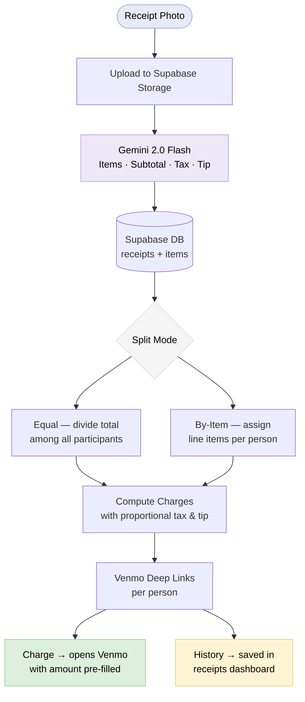

# Open Tab

Open Tab is a mobile-first bill-splitting app that turns a photo of a receipt into Venmo payment requests. Split equally or by item, charge friends in one tap.

---

## Problem

Splitting a dinner bill is a solved social problem and an unsolved technical one. Everyone has a calculator and a Venmo app, but the actual work of reading the receipt, doing the math, opening Venmo, typing the amount and username, and sending the request takes too long by the person who paid.

---

## Solution

Photograph the receipt. A vision model reads it and pulls out every line item, the subtotal, tax, and tip. Choose equal split or assign specific items to each person. The app computes each friend's share and generates a deep link straight into Venmo with the amount and note pre-filled — one tap per person to send the request.

For groups, the person who paid can skip the assigning entirely: share a link or QR code and let everyone **claim their own items** with no login. When claiming closes, the app splits anything left over, tallies each person, and hands the owner one-tap Venmo requests to collect.

**Stack:** Next.js 16 + React 19 + TypeScript + Tailwind CSS v4 + Supabase (PostgreSQL + Auth + Storage) + Gemini 2.0 Flash

  

  
  

### User journeys

- **Guest — zero-signup split.** Tap **Get started** on the landing page to open an anonymous session. Scan, split, and share a check immediately; Venmo is only requested at share time. Upgrade to a full account later to keep history.
- **New account — full onboarding.** Sign in with an email one-time code, add a Venmo username once, and land on the dashboard with a persistent history of every tab.
- **Scan → split → charge (the core flow).** Capture a receipt → Gemini itemizes it → edit anything that's off → split equally or assign items per person → tap Venmo to charge each friend and mark them paid. The whole flow survives a page refresh.
- **Crowd-claim share.** Share a receipt's link or QR code. Anyone opens it — no login — and claims their own items. The owner watches claims arrive live, closes claiming, and collects each person's total through pre-filled Venmo requests; unclaimed items fall back to the owner.
- **Friends & invites.** Add friends by Venmo username (a real two-way friendship if they're on Open Tab, otherwise a saved contact) or share a QR invite link to connect. Saved friends speed up assigning on future splits.
- **Revisit a tab.** Every tab lives on the dashboard with a status badge. Reopen it to keep editing, check claim progress, or re-send a charge — access is limited to the owner and listed participants.

### Key features

| Feature | Benefit |
|---|---|
| AI receipt scanning (Gemini 2.0 Flash) | Turns a photo into itemized data in seconds — no manual typing, handles printed and handwritten receipts |
| Equal & by-item splitting | Fits any table, from an even split to everyone paying for exactly what they ordered |
| Proportional tax & tip | Each person's tax and tip scale to their share, so the split is actually fair |
| One-tap Venmo deep links | Opens Venmo with amount, note, and username pre-filled — the payment request is one tap, not five |
| Crowd-claim share links | Groups self-serve their own items with no login, removing the paying person's assigning work entirely |
| Guest mode (anonymous auth) | Split a bill with zero signup friction; upgrade to a full account only when you want history |
| Friends & QR invites | Reusable contacts and quick connections make repeat splits faster |
| Persistent flow state | A mid-split page refresh never loses progress — the flow resumes exactly where it left off |
| Tab history dashboard | Every past split stays organized and re-openable, with clear paid/unpaid status |

---

## Architecture

```mermaid
flowchart TD
    PH([Receipt Photo])

    PH --> UP[Upload to Supabase Storage]
    UP --> GM[Gemini 2.0 Flash\nItems · Subtotal · Tax · Tip]
    GM --> DB[(Supabase DB\nreceipts + items)]

    DB --> SP{Split Mode}
    SP --> EQ[Equal — divide total\namong all participants]
    SP --> BI[By-Item — assign\nline items per person]

    EQ --> CH[Compute Charges\nwith proportional tax & tip]
    BI --> CH

    CH --> VL[Venmo Deep Links\nper person]

    VL --> BUY[Charge → opens Venmo\nwith amount pre-filled]
    VL --> HIST[History → saved in\nreceipts dashboard]

    style PH fill:#e8eaf6,stroke:#9fa8da,color:#000
    style GM fill:#ede7f6,stroke:#b39ddb,color:#000
    style SP fill:#f5f5f5,stroke:#ddd,color:#000
    style BUY fill:#dcf0dd,stroke:#9ecba1,color:#000
    style HIST fill:#fdf4d3,stroke:#e8cb7a,color:#000
```

The multi-step flow (capture → scanning → split → charge) is managed by a single `useReceiptFlow` hook, persisted to `sessionStorage` so refreshes don't lose progress. Receipts and their items are stored in Supabase; charges are computed client-side from the split configuration.

---

## Tradeoffs and Decisions

| Decision | What I considered | What I chose and why |
|---|---|---|
| Receipt parsing | Dedicated OCR (Tesseract, AWS Textract) or a vision model | Gemini 2.0 Flash with a structured JSON prompt — handles printed and handwritten receipts without custom training, returns typed data directly |
| Venmo integration | Full OAuth API (request money, track status) | Deep links only — Venmo's OAuth requires API approval and adds auth complexity. Deep links are a documented public interface, work instantly on mobile, and required nothing beyond a URL format |
| Flow state persistence | Server-persisted draft receipts written on every edit | `sessionStorage` in the `useReceiptFlow` hook — zero latency during editing, no DB writes until the user finalizes, survives page reloads within the same tab |
| Tax & tip distribution | Split tax and tip equally among all participants | Distribute proportionally by item share — fairer when people ordered different-priced items; small overhead since the item amounts are already computed |

---

## Learnings

- **Scoping a user flow requires communicating your vision clearly first:** The initial flow had too many steps and edge cases — it covered everything I could imagine rather than the core use case. When I shared it, the scope confused rather than communicated. Writing out the intended experience in plain language before building would have aligned expectations faster and cut a lot of rework.

- **A minimal visual baseline invites the wrong feedback:** The first design pass was functional but bare. Sharing it early pulled feedback toward aesthetics rather than flow. Bringing in a strong visual direction — liquid glass, the indigo palette, the mobile-native feel — earlier in the process redirected the conversation to what actually mattered.

- **Venmo is unavoidable even when it's difficult:** Users pay each other on Venmo; building around that is not optional. The official API requires an approval process that's inaccessible for a side project, but the deep link format is a documented public interface. Working within that constraint produced a UX that's arguably better — no OAuth redirect, amount and note pre-filled, payment opens directly in the native app.
